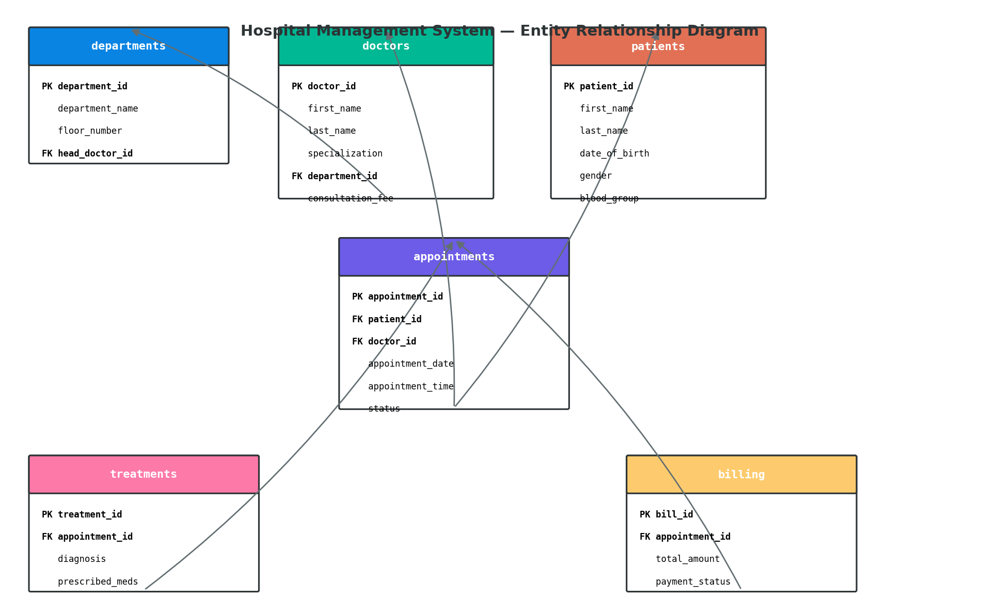
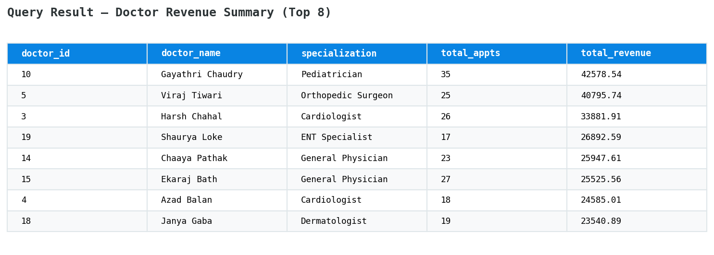
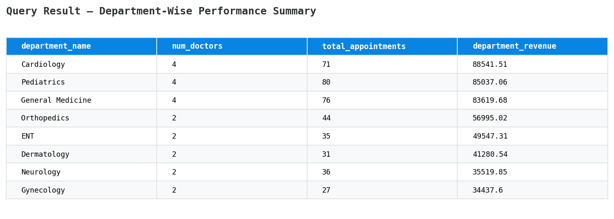
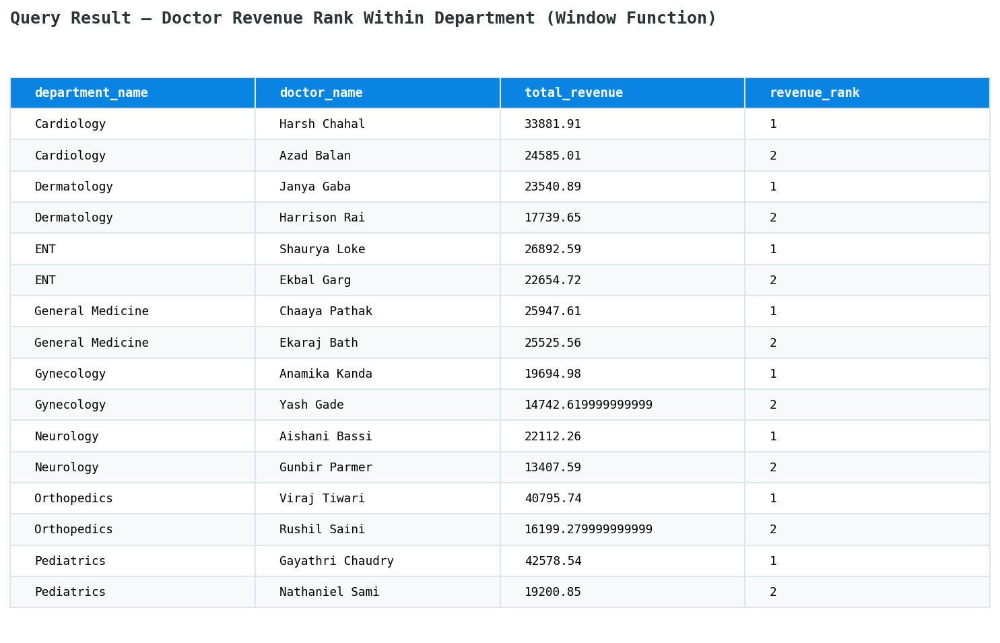
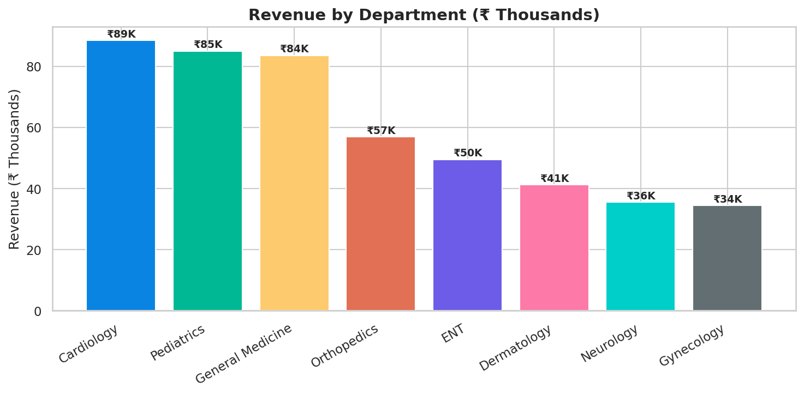
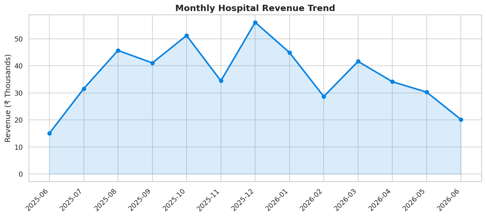

# 🏥 Hospital Management System — SQL Database Project

A relational database project simulating a multi-department hospital's operations — patients, doctors, appointments, treatments, and billing — designed in **MySQL** with **15 analytical queries** demonstrating joins, aggregations, subqueries, CTEs, and window functions.


---

## 📌 Project Overview

This project models a real-world hospital management system with **6 interconnected tables**, populated with **150 patients, 22 doctors, 400 appointments, and 288 billing records** across 8 departments. It demonstrates database design principles (normalization, foreign keys, constraints) and SQL querying skills used in data analyst and backend roles.

### Business Questions Answered
- Which doctors and departments generate the most revenue?
- Which patients are frequent visitors (loyalty/retention insight)?
- What's the monthly revenue trend across the hospital?
- Which diagnoses are most common (resource planning)?
- Which doctors have above-average no-show rates?
- What % of revenue comes from each payment method?

## 🗂️ Database Schema (ER Diagram)



**6 Tables:** `departments` → `doctors` → `appointments` ← `patients`, with `treatments` and `billing` linked to `appointments`.

## 📂 Repository Structure

```
hospital-management-sql/
├── schema/
│   └── 01_create_schema.sql      # CREATE TABLE statements, constraints, indexes
├── sample_data/
│   └── 02_insert_data.sql        # 150 patients, 22 doctors, 400 appointments, etc.
├── queries/
│   └── 03_analytical_queries.sql # 15 business-question queries
├── screenshots/                  # Query outputs & charts
└── README.md
```

## 🛠️ Tech Stack
- **Database:** MySQL 8.0
- **Concepts used:** JOINs (INNER/LEFT), GROUP BY/HAVING, Subqueries, CTEs (`WITH`), Window Functions (`RANK`, `SUM() OVER`), CASE statements, Generated Columns, Date functions, Indexing

## 📊 Sample Query Results

**Doctor Revenue Summary (Top 8)**


**Department-Wise Performance**


**Revenue Ranking Within Department (Window Function)**


**Revenue by Department (Chart)**


**Monthly Revenue Trend (Chart)**


## 💡 Key Insights From the Data

| Insight | Finding |
|---|---|
| Top Department by Revenue | Cardiology (₹89K) |
| Top Department by Volume | Pediatrics (80 appointments) |
| Most Common Diagnosis | Type 2 Diabetes |
| Patient Age Split | Seniors (60+) are the largest segment |
| Payment Method Split | UPI leads at ~27% of revenue |

## 🚀 How to Run

```bash
# 1. Open MySQL CLI or Workbench
mysql -u root -p

# 2. Run schema creation
source schema/01_create_schema.sql;

# 3. Load sample data
source sample_data/02_insert_data.sql;

# 4. Run analytical queries
source queries/03_analytical_queries.sql;
```

## 👤 Author

**Salman Humer Khan**
Data Analytics Fresher | Computer Engineering
📍 Akola, Maharashtra, India

- GitHub: [@salman7276h](https://github.com/salman7276h)
- LinkedIn: [salman72](https://linkedin.com/in/salman72)

---
*Dataset is synthetically generated for portfolio demonstration purposes and does not represent real patient data.*
